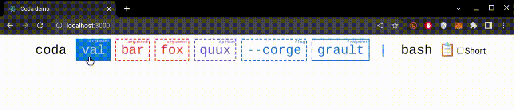

# Coda

<p align='center'>
    
</p>

<p align='center'>
    
</p>

**Co**mmand **d**ocumentation **a**pp - a web tool for describing cli features.

For instruction on running the library app see docs in the [coda](/coda) folder.

## Installation

To install the project run the following command:

```sh
npm install @zeionara/coda
```

To update execute the following command:

```sh
npm install @zeionara/coda@latest
```

## Usage

Usage examples are provided in the [corresponding folder](/examples). In particular, the tool can be used as shown in the snippet below, which allows to obtain the configuration demonstrated on the image above:

```tsx
import { Command, Argument, Option, Flag, Operator, OperatorValue, Header, Fragment } from '@zeionara/coda'

function App() {
  return <div className="App">
    <Command name="coda">
      <Argument name="describe" description="describe command features" theme="blue" value="val"/>
      <Argument name="bar" description="describe command features" theme="red" optional/>
      <Argument name="fox" description="describe command features" theme="red" optional/>
      <Option name="quux" shortName="q" description="describe command features" theme="violet" optional/>
      <Flag name="corge" shortName="c" description="my first flag" theme="blue" optional enabled/>
      <Fragment name="grault" description="my first fragment" theme="blue" optional/>
      <Operator value={OperatorValue.Pipe} theme="blue"/>
      <Header name="bash"/>
    </Command>
  </div>
}
```
